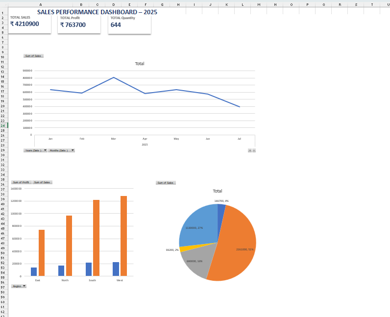

# Sales Performance Dashboard (Excel Project)

## About This Project

This is an Excel dashboard project where I analyzed sales data using Pivot Tables and charts.  
The goal was to understand sales performance, profit distribution, and product trends in a clear visual format.

In this dashboard, I worked on:

- Monthly sales trend analysis  
- Region-wise sales and profit comparison  
- Product category distribution  
- KPI summary (Total Sales, Profit and Quantity)

## 📸 Dashboard Preview

## Key Numbers

- Total Sales: ₹ 42,10,900  
- Total Profit: ₹ 7,63,700  
- Total Quantity Sold: 644  

## Tools Used

- Microsoft Excel  
- Pivot Tables  
- Pivot Charts  
- KPI Cards  
- Basic dashboard formatting and data visualization  

This project helped me improve my skills in data cleaning, pivot analysis, and dashboard presentation.

---

Created by Shabila
